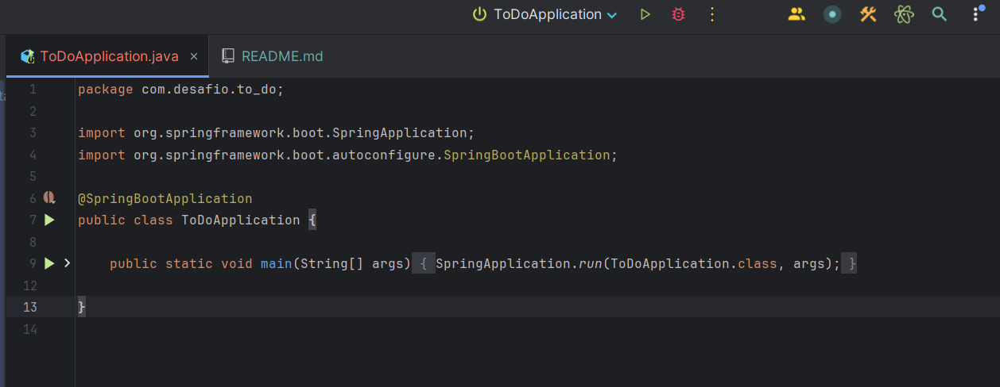

<h1>Tutorial para teste da API de To Do!</h1>

<h2>1. Clone o repositório localmente.</h2>

<h4> Rode o seguinte comando no diretorio que você deseja clonar o projeto: </h4>

    git clone https://github.com/Rodolfo1705/to-do-list.git

 

<h2>2. Execute o projeto.</h2>

<h4> Utilize uma IDE de sua preferência para rodar a API.

Recomendação: IntelliJ IDEA.

- Encontre o arquivo 'ToDoApplication'
(to-do/src/main/java/com.desafio.to_do/ToDoApplication.java)

 
 

 - Clique em qualquer um dos ícones de 'Start'.

</h4>

 

<h2>3. Realize as requisições para testar a API. </h2>

<h4> Localize o arquivo 'Desafio - To Do.postman_collection.json'
    
(to-do/postman/Desafio - To Do.postman_collection.json)

* Pelo explorador de arquivos, selecione o arquivo, arraste-o para o simulador de client de sua preferência.
Recomendação: Postman

* Feito isso, por conta do banco utilizado ser o H2 (banco em memória) execute primeiro a requisição de POST, para que algum registro seja adicionado ao banco.

</h4>

 

<h2> Prontinho! Teste à vontade. </h2>
